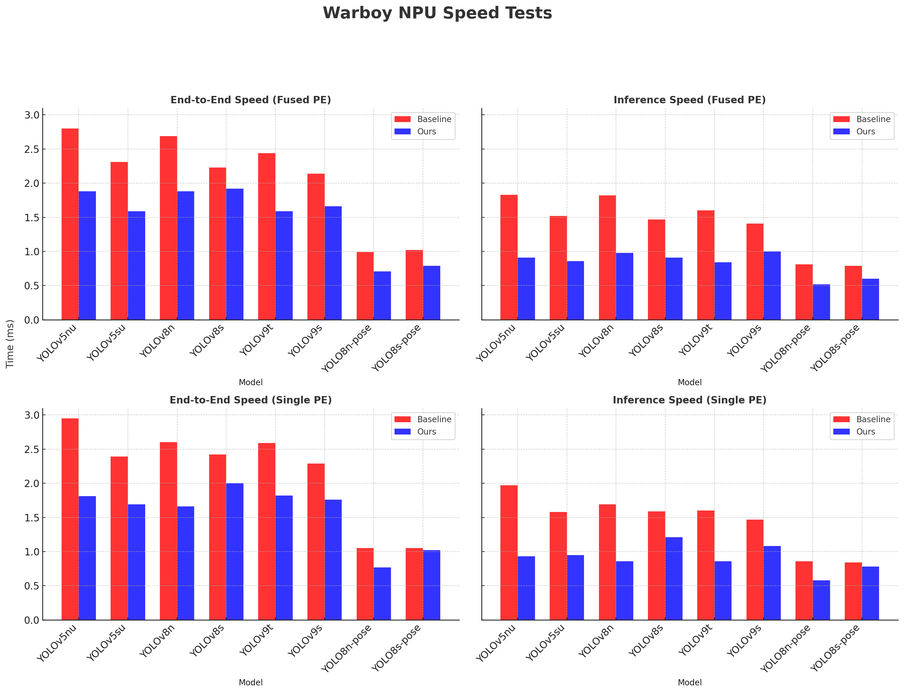
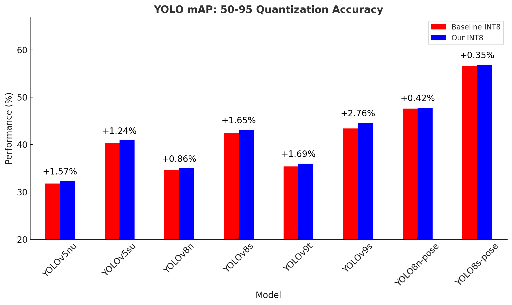

<center>
    
</center>

# furiosa-warboy-inference

Starter code for running quantized YOLO models on [Warboy](https://furiosa.ai/warboy), [Furiosa AI](https://furiosa.ai/)'s 1st generation 14nm 64 TOPS NPU.

Compared to the [baseline code](https://github.com/furiosa-ai/warboy-vision-models), we optimize the code for throughput-oriented tasks, with batching and postprocessing improvements. We also provide a simple dashboard for monitoring NPU utilization.

Joint work done with [Githarold](https://github.com/Githarold).

## Installation

### Furiosa AI - Warboy SDK Installation

Checking the SDK documentation is recommended before running the code. The SDK documentation can be found [here](https://furiosa-ai.github.io/docs/latest/en).

You should install:
    - [Driver, Device, and Runtime](https://furiosa-ai.github.io/docs/latest/en/software/installation.html)
    - [Python SDK](https://furiosa-ai.github.io/docs/latest/en/software/python-sdk.html), as well as 
    - [Command Line Tools](https://furiosa-ai.github.io/docs/latest/en/software/cli.html)

### Building the Decoder

We use a custom decoder for running quantized YOLO models on Warboy. The decoder can be built using the following commands:

```bash
chmod +x ./scripts/build_decoder.sh
cd decoder
make
```

### Create Directory Structure

Create model directories for storing the quantized models:

```bash
chmod + x ./scripts/create_model_dirs.sh
./scripts/create_model_dirs.sh
```

## Running

We provide baseline code for running quantized YOLO models on Warboy. The script can be run using the following commands:

```bash
python run.py 
    --model [MODEL_NAME]
    --num_workers [NUM_WORKERS] # number of worker threads
    --batch_size [BATCH_SIZE] # batch size
    --save_step [SAVE_STEP] # save step for quantized ONNX (for example, if set to 10, a model will be saved every 10 calibration steps)
    --num_calib_imgs [NUM_CALIB_IMGS] # number of calibration images
    --calib_method [CALIB_METHOD] # calibration method for quantization (see docs - https://furiosa-ai.github.io/docs/latest/en/api/python/furiosa.quantizer.html#module-furiosa.quantizer)
    --calib_p [CALIB_P] # calibration percentile
    --device [DEVICE] # device configuration for NPUs (see docs - https://furiosa-ai.github.io/docs/latest/en/api/python/furiosa.runtime.html#device-specification)
    --input_type [INPUT_TYPE] # type of input data (float32 or uint8)
    --output_type [OUTPUT_TYPE] # type of output data (float32, int8, or uint8)
    --fuse_conv_bn [FUSE_CONV_BN] # whether to fuse conv and bn layers
    --simplify_onnx [SIMPLIFY_ONNX] # whether to use onnx-simplify
    --optimize_onnx [OPTIMIZE_ONNX] # whether to use onnxoptimizer
    --do_trace [DO_TRACE] # whether to trace the model (can view with snakeviz)
    --do_profile [DO_PROFILE] # whether to profile the model (can view with traceprocessor, from Perfetto)
    --scheduling [SCHEDULING] # scheduling method (round_robin or queue, see docs - https://furiosa-ai.github.io/docs/latest/en/api/python/furiosa.runtime.html#runner-api)
    --input_queue_size [INPUT_QUEUE_SIZE] # input queue size, for queue scheduling
    --output_queue_size [OUTPUT_QUEUE_SIZE] # output queue size, for queue scheduling
```

**Example Commands**

```bash
python run.py \
    --model "yolov8s" \
    --num_workers 4 \
    --batch_size 16 \
    --num_calib_imgs 10 \
    --calib_method "MIN_MAX_ASYM" \
    --device "npu0pe0-1" \
    --fuse_conv_bn \
    --simplify_onnx \
    --optimize_onnx \
    --scheduling "queue"
```

## Improvements

The following are the most impactful improvements, with respect to the baseline code:

1. Batching
    - The baseline code is for latency-oriented tasks, with a batch size of 1.
    - We enable batching for throughput-oriented tasks, with a batch sizes that are powers of 2.
    - Unlike the baseline dataloader, we adopt the DataLoader from torch
2. Postprocessing
    - We optimize non-maximum suppression (NMS) and rounding methods, the 2 main bottlenecks in profiling results.

## Results

We run some preliminary experiments on 8 different YOLO models. Baseline stats are from [refactor_jw branch](https://github.com/furiosa-ai/warboy-vision-models/tree/refactor_jw) of [furiosa-ai/warboy-vision-models](https://github.com/furiosa-ai/warboy-vision-models/).

Warboy, the target NPU, has 2 processing elements (PEs) per chip. Inference can be done by either using a single PE or using PE-fusion (fused mode, see [paper](https://ieeexplore.ieee.org/document/9927346) for details).

### Speed Tests



### Quantization Tests



## NPU Utilization Dashboard

We provide a simple dashboard for monitoring NPU utilization. The dashboard can be run using the following commands:

```bash
python my_utils/npu_util_viewer.py
```

### Example - YOLOv8-pose

| Baseline - Round Robin (`batch_size`=1) | Round Robin (`batch_size`=16) | Queue (`batch_size`=16) |
|--------------------------|--------------------------|--------------------------|
|  |  |  |

## References

- [Furiosa AI - Warboy](https://furiosa.ai/warboy)
- [Baseline Code](https://github.com/furiosa-ai/warboy-vision-models)
- [Furiosa AI - SDK Documentation](https://furiosa-ai.github.io/docs/latest/en)
- [A 64-TOPS Energy-Efficient Tensor Accelerator in 14nm With Reconfigurable Fetch Network and Processing Fusion for Maximal Data Reuse, Lee et al., 2024](https://ieeexplore.ieee.org/document/9927346)